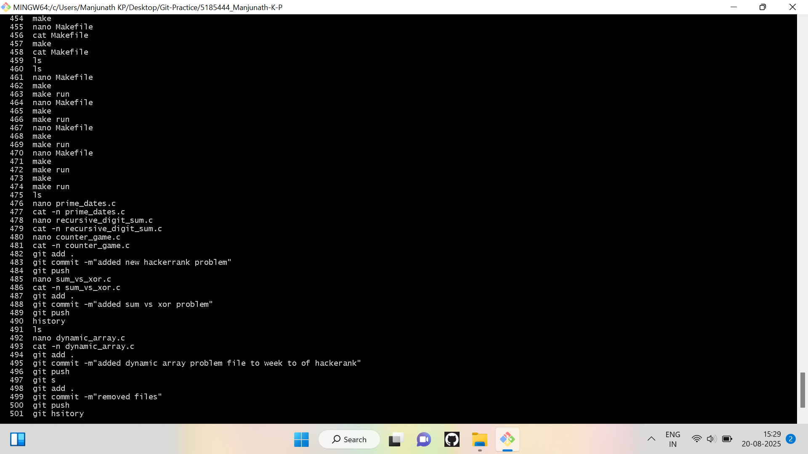
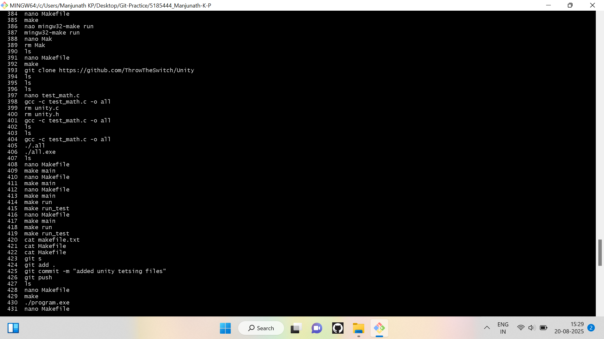
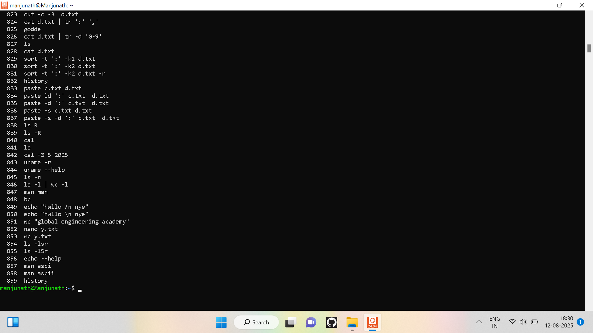
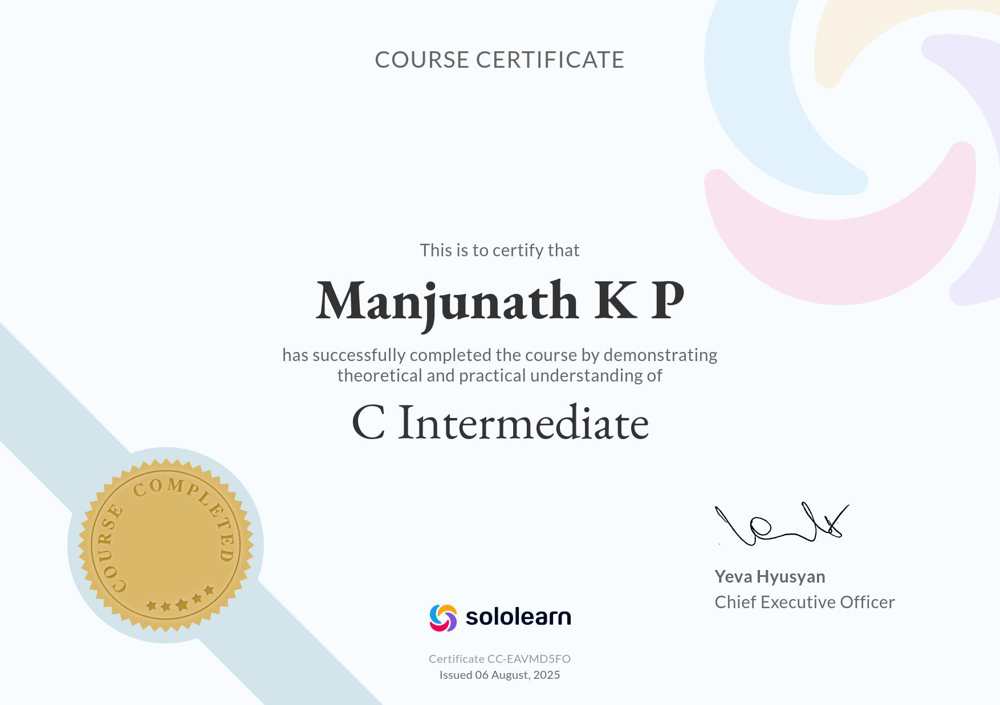
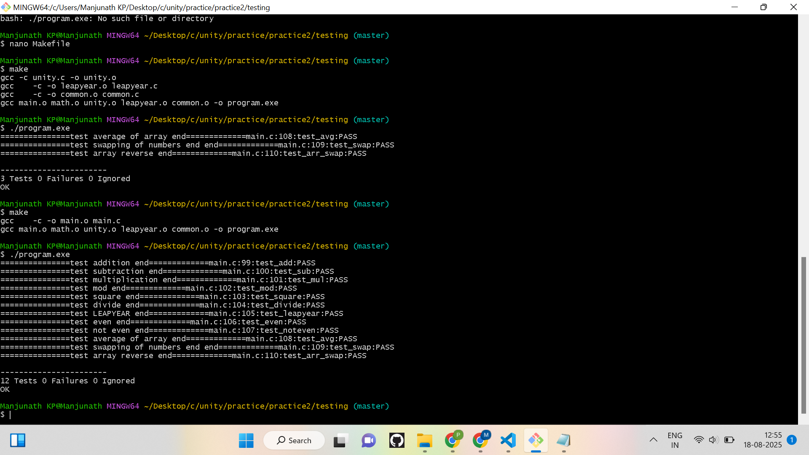
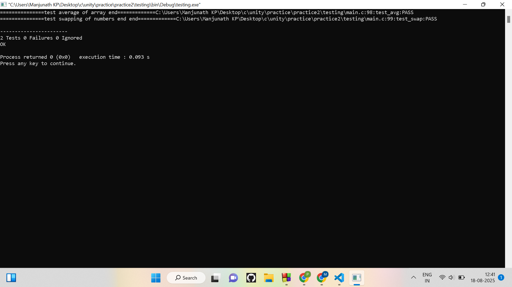
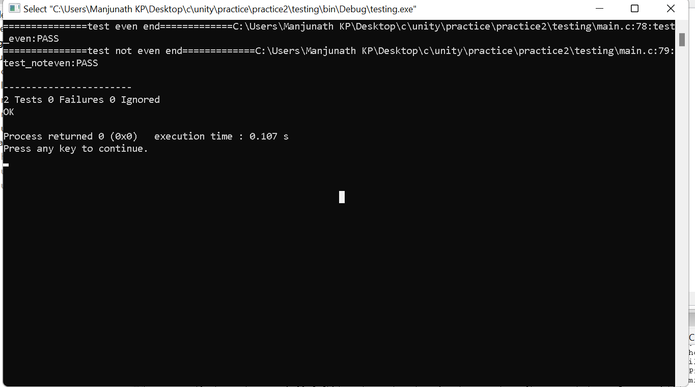
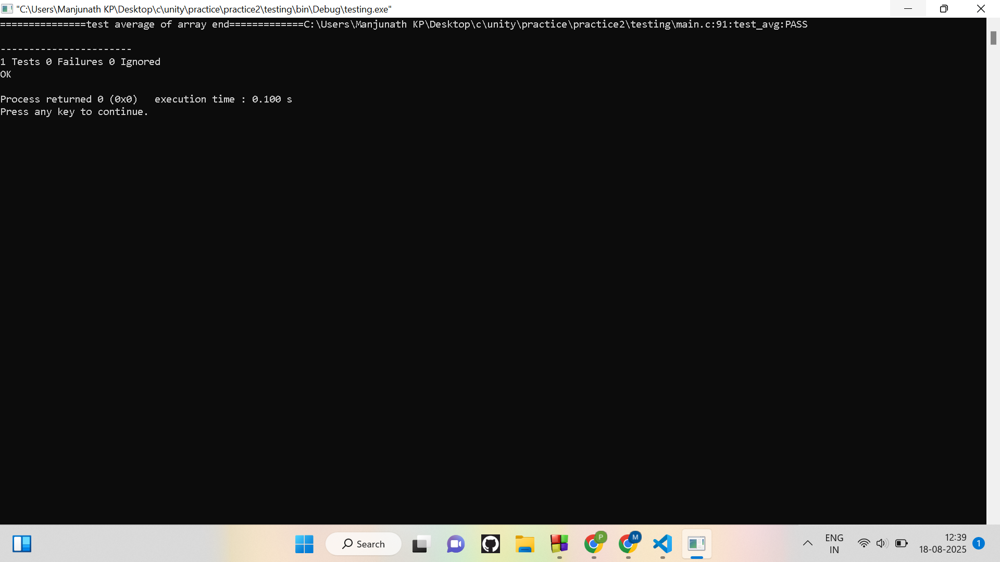
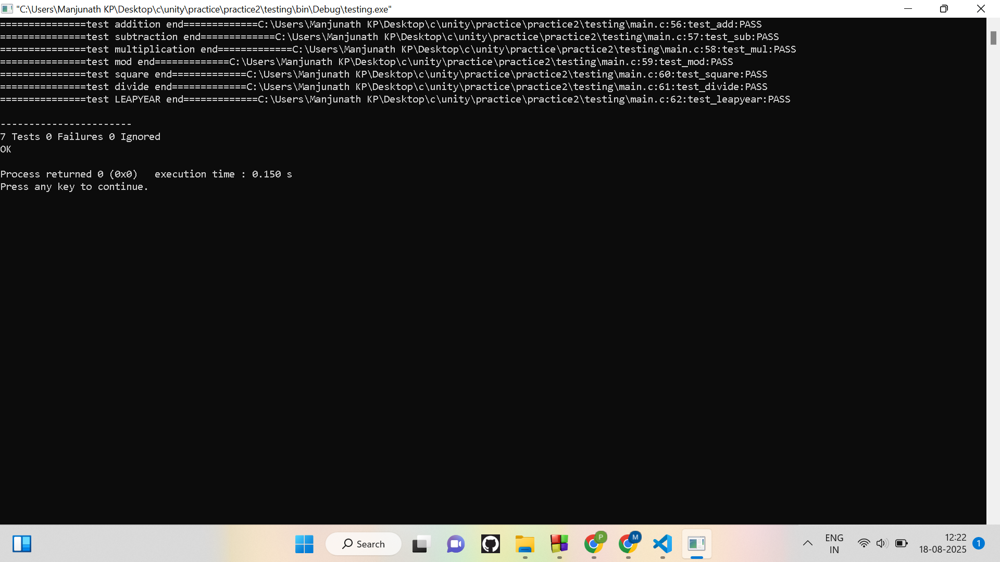
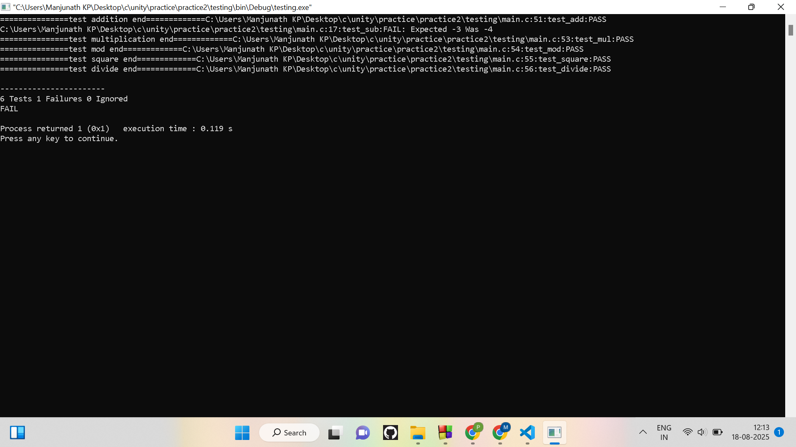

# 5185444_Manjunath-K-P

<a href="#1" style="color:white; text-decoration:none; margin: 0 20px; font-weight:bold; font-size:18px;">🛠️ SDLC</a>

<a href="#2" style="color:white; text-decoration:none; margin: 0 20px; font-weight:bold; font-size:18px;">🌱 GIT</a>

<a href="#3" style="color:white; text-decoration:none; margin: 0 20px; font-weight:bold; font-size:18px;">💻 LINUX</a>

<a href="#4" style="color:white; text-decoration:none; margin: 0 20px; font-weight:bold; font-size:18px;">⚡ C PROGRAMMING</a>

<a href="#5" style="color:white; text-decoration:none; margin: 0 20px; font-weight:bold; font-size:18px;">🧪 UNITY TESTING</a>

## 📚 Overview

Welcome to my repository! This is a comprehensive record of my learning journey through:

- **📘 SDLC (Software Development Life Cycle)**
- **🛠️ Git & Version Control**
- **🐧 Linux Command Line**
- **💻 C Programming Fundamentals**
- **🧪 Unit Testing with Unity Framework**

It contains **certificates**, **hands-on exercises**, and **practical command-line tasks** to showcase my progress and skills.

---

<section id="1">
<h1>SDLC</h1>

  

  

</section>
<section id="2">
<h1>GIT</h1>

  

  

  

</section>
<section id="3">
<h1>LINUX</h1>

  

  

  

</section>
<section id="4">
<h1>C PROGRAMMING</h1>

  

  

</section>
<section id="5">
<h1>UNITY FRAMEWORK</h1>

  

  

  

  

  

  

</section>
