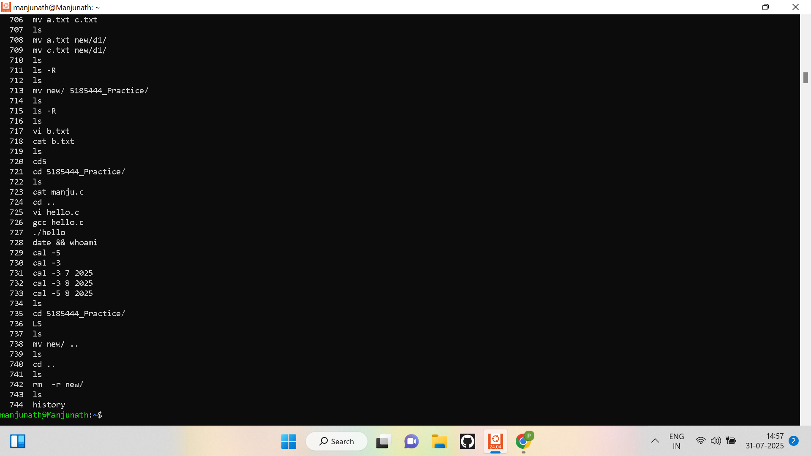

# 5185444_Manjunath-K-P

<a href="#1" style="color:white; text-decoration:none; margin: 0 40px; font-weight:bold; font-size:18px;">🛠️ SDLC</a>
<a href="#2" style="color:white; text-decoration:none; margin: 0 40px; font-weight:bold; font-size:18px;">🌱 GIT</a>
<a href="#3" style="color:white; text-decoration:none; margin: 0 40px; font-weight:bold; font-size:18px;">💻 LINUX</a>
<a href="#4" style="color:white; text-decoration:none; margin: 0 40px; font-weight:bold; font-size:18px;">⚡ C PROGRAMMING</a>

<section id="1">

  

  

</section>
<section id="2">

  

</section>
<section id="3">

  

  

  

</section>
<section id="4">

  

  

</section>
